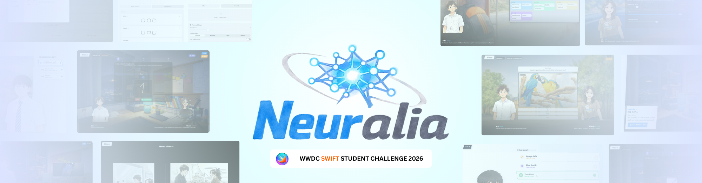
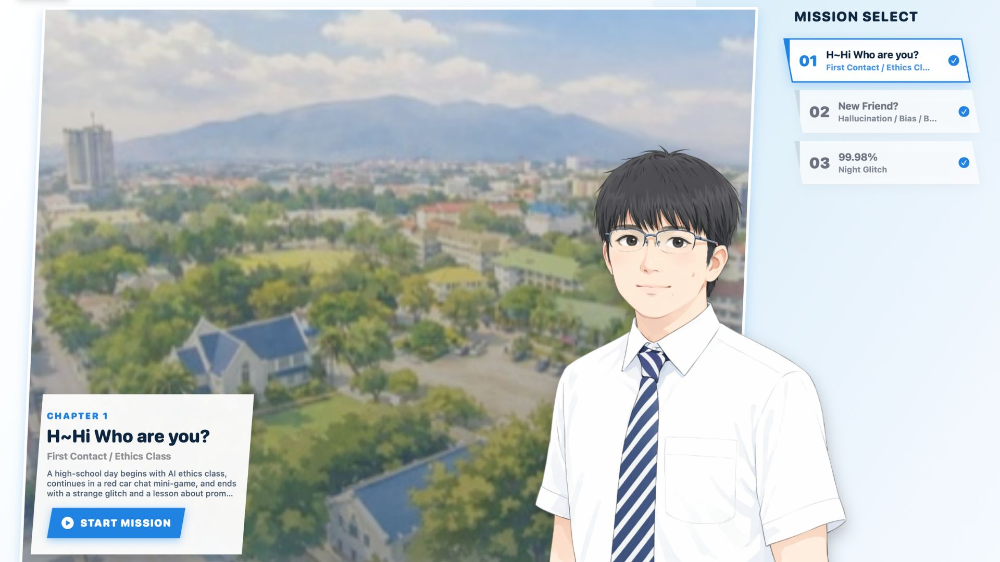
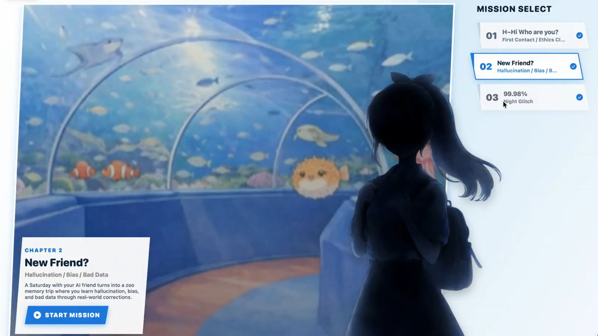
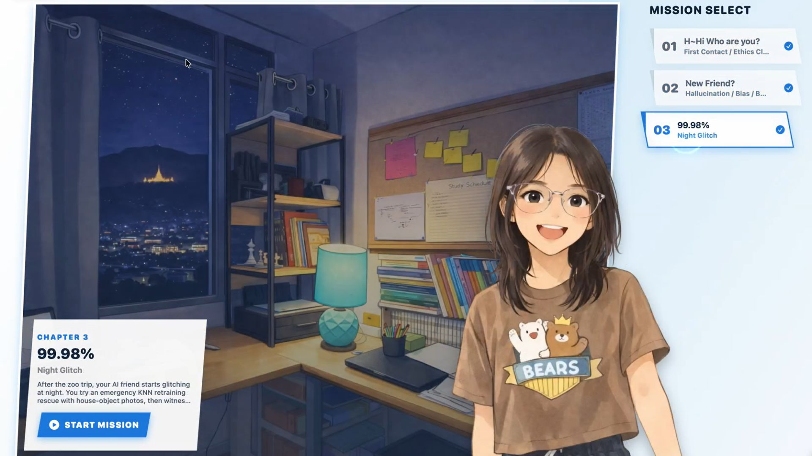

# WWDC26 Swift Student Challenge Submission - Neuralia

Hi I'm jean and this is my submission for Swift Student Challenge 2026 ✨.

----

### Submissions Data

| Name | Source |    Video    | Technologies | Status |
|-----:|:------:|:-----------:|:-------------|:------:|
|[Jnx03](https://www.jnx03.xyz/)|[GitHub](https://github.com/JNX03/Neuralia)|[Video](https://www.youtube.com/watch?v=EtrBb8nzsfI)|SwiftUI , Combine , Foundation , AVKit , AVFoundation ,PhotosUI , UIKit||

**Neura** is an interactive, story-driven educational iOS/iPadOS application built entirely with SwiftUI. Set against the vibrant backdrop of Chiang Mai, Thailand, it functions as a Visual Novel mixed with interactive minigames. The core purpose of the app is to guide students and beginners through the complexities of Artificial Intelligence (AI)—specifically focusing on AI ethics, prompt engineering, how AI models make mistakes (hallucinations, bias, bad data), and foundational machine learning principles like K-Nearest Neighbors (KNN).

## Installation

1. Go to the **[Neuralia Releases](https://github.com/JNX03/Neuralia/releases/tag/V2.1)** page (or download the **latest version**).
2. Download **`Neura.swiftpm.zip`**.
3. **Extract** the ZIP file.
4. Open the extracted project using **Xcode** or **Swift Playgrounds**.
5. **Run the project** — Done! 🎉

## Story

The core narrative follows the player (a student) who accidentally manifests an AI entity into the real world. Across three distinct chapters, the player interacts with this newly materialized AI and their teacher, Professor New, to learn essential lessons about responsible AI usage. 

### Chapter 1: "H~Hi Who are you?" (First Contact & AI Ethics)

*   **The Story:** The game begins in an AI ethics class taught by Professor New. After class, while riding a "red car" (รถสี่ล้อแดง) home, the player receives a series of strange text messages from an "Unknown User" whose signal is highly distorted and noisy. To clear up the noise and fix the communication, the player must build a structured prompt. That night, the player's phone glitches uncontrollably, and the AI physically appears in their bedroom.
*   **What It Teaches:** 
    *   **Prompt Engineering:** How to build an effective and clear prompt using the `[Goal] + [Context] + [Action] + [Format]` framework.
    *   **Applied AI Ethics:** Through an interactive lecture quiz, players learn about verifying health answers from trusted sources, protecting privacy by aggressively removing personal information from images before uploading them, recognizing biased outputs, and verifying fake AI citations.
    *   **Core Message:** Confidence from an AI model is absolutely not proof of truth.

### Chapter 2: "New Friend?" (Hallucination, Bias, and Bad Data)

*   **The Story:** The next Saturday morning, the AI is still lingering in the player's room. To test if the AI really understands the world, the player asks for the time. The AI confidently guesses an impossible, nonsensical time ("10:67"). To help the AI build real-world memories, the player takes it on a field trip to the Chiang Mai Zoo. There, the AI tries to guess animals but makes repeated mistakes based on bad clues (such as blurry vision or confusing training data). Later, they review these mistakes together.
*   **What It Teaches:**
    *   **Hallucination:** Understanding that AI can and will generate answers that sound highly plausible but are entirely fake when it lacks proper context. Real-world validation is necessary.
    *   **Allowing Uncertainty:** Teaching the AI that it's infinitely better to admit "I'm not sure" than to confidently guess a wrong answer.
    *   **Bias & Bad Data:** A dedicated "Bias Data Audit" minigame where the player categorizes why the AI made mistakes, vividly illustrating how poor input data inevitably leads to incorrect AI assumptions.

### Chapter 3: "99.98%" (Night Glitch & KNN Rescue)

*   **The Story:** That night, the AI's physical signal becomes highly unstable, and its memories start corrupting rapidly. It begins to glitch out and dissolve into static. In a panic, the AI instructs the player to execute an "Emergency KNN Rescue" by taking real photos of everyday objects around the room (a pen, a hand, a water bottle) to serve as anchors for its memory patterns. The distance matching stabilizes at a critical `99.98%`. The AI physically disappears from the room, seemingly destroyed forever, but a message suddenly buzzes on the player's phone—the AI successfully transferred itself safely into the device.
*   **What It Teaches:**
    *   **Machine Learning (K-Nearest Neighbors):** An interactive image training experience utilizing the device camera. The player takes real photos to provide "training samples," illustrating exactly how AI models classify objects based on geometric distance/similarity to known examples.

---
## 🙏 Acknowledgements

Special thanks to **@newlesk** (my teacher - he also professor new in the game) and my friends for testing the app and providing valuable feedback and suggestions. Your insights helped refine the experience and improve the overall quality of Neuralia.

More about the Swift Student Challenge: https://developer.apple.com/swift-student-challenge/ 🍎

## 📌 Looking Ahead
> [!NOTE]  
> Hello! 👋 Want more project ideas? see my 2025 submission! 👀  
> 👉 https://github.com/JNX03/Syntaxia (winner)

| Name | Source |    Video    | Technologies | Status |
|-----:|:------:|:-----------:|:-------------|:------:|
|[Jnx03](https://www.jnx03.xyz/)|[GitHub](https://github.com/JNX03/Syntaxia)|[Video](https://youtu.be/zJ4cAt7An84)|SwiftUI, Speech synthesis, Natural Language, Avfoundation , AVKit , AudioToolbox , Vision , UniformTypeIdentifiers , ScreenKit||
